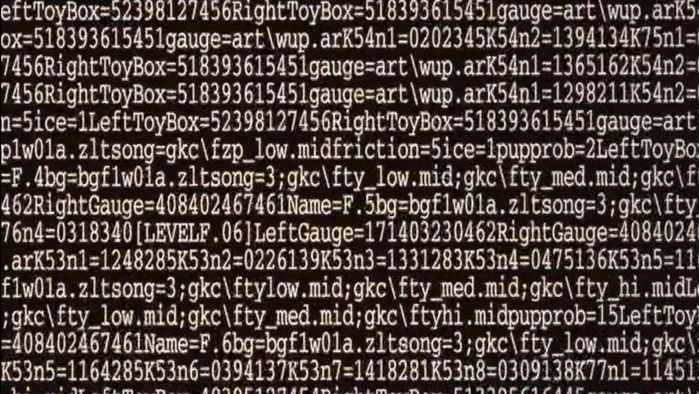

# Complexity and Reasoning in Functional Programming

[Kris Nuttycombe](http://github.com/nuttycom)

April 19, 2014

#

> "Let me take you on an adventure which will give you superpowers."

[Chris Allen](https://twitter.com/bitemyapp/status/455464035987623936)

I believe that it is possible to write perfect software. By "perfect", I mean
something very specific: that every state that is representable in source code
is a valid state, and that no invalid states may be obtained by the process of
assembly of the program's components. 

Now, this is a fine sentiment, but it obviously depends very much upon what is
considered to be invalid. A reasonable first estimation of an invalid state is
one that is unexpected; naturally, such a state definitionally is one that the
programmer has not prepared the program to operate correctly from.

#

## What is a program?

A program serves a single purpose: to describe the transformation of
information from one form to another. Most of the time, this transformation
involves many intermediate steps, and may involve various parties along the way
responsible for providing or interpreting the data being transformed. 

You'll note that I say "describes the transformation" rather than "transforms."
Even if a program is never evaluated, it describes a fact about the universe:
that some input data can be combined or reduced to yield some output data. 

Now, I'm going to write the simplest program possible.

By the way. I'm going to jump confusingly back and forth
between Haskell and Scala in this talk, mostly because I don't know Haskell
very well. For the things I know how to express in it, it's just flat out
better at expressing them than Scala is, but I think that for some other
things, until you get used to Haskell syntax, Scala is better. This is 
an opinion some of you will probably throw tomatoes at me for holding; that's
fine.

#

## A very simple program

~~~{.haskell }
True
~~~

This program represents a single state.

#

~~~{.haskell}
data Bool = True | False

bool :: Bool
~~~

How many states can the program `bool` represent?

#

The following program represents an application with 2^32 possible states.

~~~{.haskell}
i :: Int32
~~~

Correctness is somewhat more difficult to define. It implies an observer, who
can check the output obtained from the evaluation of a program against the
output which was originally desired, which motivated the creation of the 
program in the first place. Provided every possible combination of inputs,
a correct program is one for which no possible output is undesired.

Of course, I'm sure many of you can immediately think of many outputs of a
program that might not be desired, so we can't be talking about desire in terms
of what makes a person happy; we have to be a little more circumspect and
consider that an error message is a desired thing in response to incorrect
input; "halted" may be a desired state in response to the unavailability of
some resource, and so forth. However, in no case such such a state be
*unexpected*.

